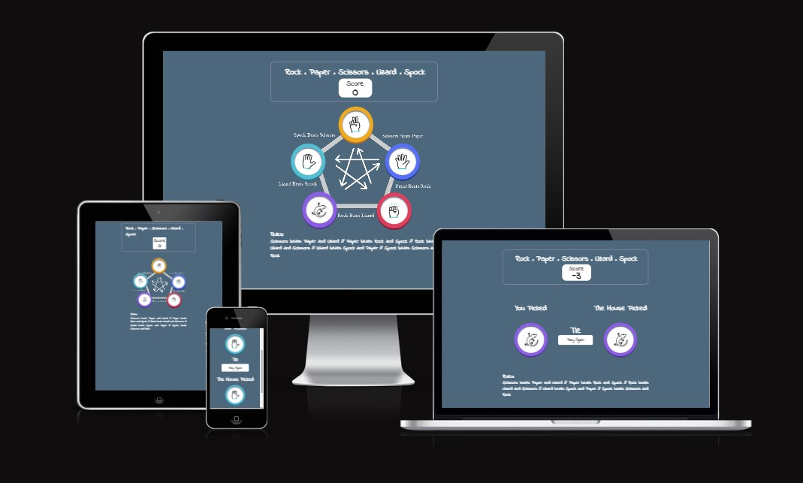
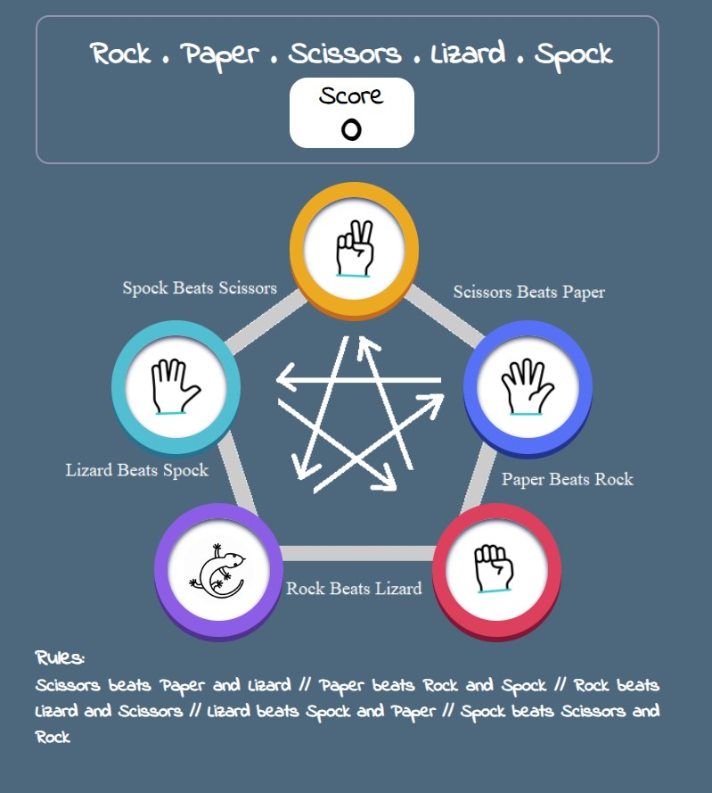
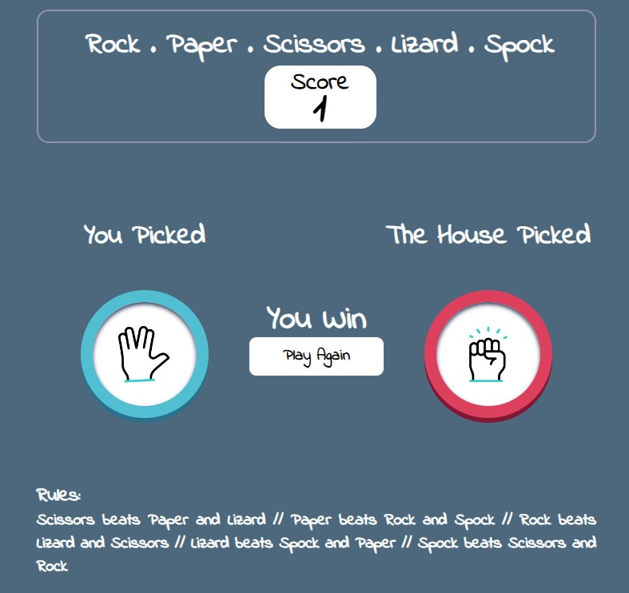
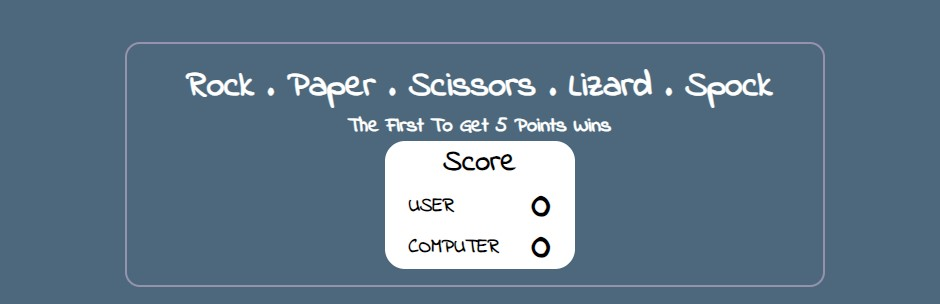
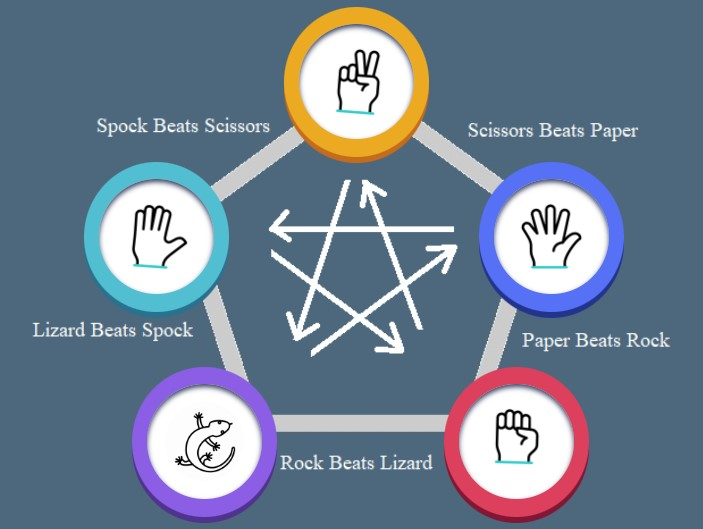

# Rock, Paper, Scissors, Lizard, Spock Game

Looking for a way to unwind and enjoy yourself? Try playing Rock, Paper, Scissors, Lizard, Spock! This game lets you choose from five options and play against the computer. Keep track of the score to see if you have better luck than your computer. Give it a try and see how you fare!

[View the live project here](https://tcaldato.github.io/rock-paper-scissors-lizard-spock-game/)

## UX

#### The ideal user for this website

- This website is perfect for anyone who needs a break and wants to enjoy themselves.

#### Current User Goals

1. Users are looking forward to having a relaxing time.
2. Their goal is to navigate the game effortlessly and access the necessary tools with ease.
3. Their desire is to play the game with ease.

#### New User Goals

1. Users want to easily understand the game rules.
2. They want to have a clear understanding of the game's score.
3. Users want visuals and color schemes that are appealing, relevant, and enjoyable to look at, and that complement the content.

#### Development

The game was designed to provide entertainment for users of all ages, from children to the elderly. It was created to be easy to understand and play, allowing users to enjoy it alone or compete with others using the game's score.

#### Target Audience

- **Roles:**
  - Current users
  - New users
  - People who enjoy playing fast-paced games

- **Demographic:**
  - All ages
  - All Countries/Cultures

- **Psychographic:**
  - Lifestyles:
    - All kind of life styles
  - Personality/Attitudes:
    - Quiet
    - Independent
    - Creative
    - Reserved

The Game needs to enable the **user** to:

- Have an easy-to-play game that accurately scores their performance and provides an enjoyable experience.

#### Structure

- The game was organized in one page:

- The Main Page is separated into three parts:

    1. The Header, with the Title of the Game and the Game Score;
    2. The Body, with five choices for the user;
    3. The Footer, with the game rules.

- When a user selects an option on the main page to play against the computer, it opens, with JavaScript, a overlapping information where they can see if they have won or lost the game:

[Back to top](#rock-paper-scissors-lizard-spock-game)
### Design

#### Color Scheme

- The color scheme was chosen with the idea of fun in mind. The colors of the card game are bright and vivid, conveying a message of energy, enthusiasm, and fun. However, the background color is a shade of blue that covers most of the screen, providing a sense of calm and softness. This prevents the user from feeling tired even after playing for extended periods of time.

#### Typography

- The typography pairing used on the site is [Indie Flower](https://fonts.google.com/specimen/Indie+Flower), imported from [Google Fonts](https://fonts.google.com/).

## Features

It is imperative that the website maintains a consistent and responsive navigation system throughout every page. For your convenience, detailed information regarding the available features of the site can be found below.

### Existing Features

- **The Header of the Game Page**

  - On the top of the game page, there is a title that displays the name of the game and a scoreboard that keeps track of the score as cards are selected.

- **The Primary Content**

  - The primary content consists of five cards containing GIFs that display the user's available choices. The options include Rock, Paper, Scissors, Lizard, and Spock. When the user selects one of these options, new information is displayed using JavaScript. This information shows whether the user won or lost the game against the computer.
  - Behind the cards game, an image was displayed that helps the user understand how the game works and how it is scored.

- **The Footer**

  - In the footer section, the user can find a detailed explanation about the game rules.

- **Features Left to Implement**

  - **Play the Game with an online friend:**
    - Feature - Provide the user with the choice to play with an online friend rather than solely with the computer.
    - Reason for not featuring in this release - I did not have enough time to create this option before the submission date and my knowledge of using other programming languages is limited.

[Back to top](#rock-paper-scissors-lizard-spock-game)
## Technologies Used
#### Main Languages Used

- [HTML5](https://en.wikipedia.org/wiki/HTML5 "Link to HTML Wikipedia")
- [CSS3](https://en.wikipedia.org/wiki/Cascading_Style_Sheets "Link to CSS Wikipedia")
- [JavaScript](https://en.wikipedia.org/wiki/JavaScript "Link to JavaScript Wikipedia")

#### Frameworks, Libraries & Programs Used

- [Google Fonts](https://fonts.google.com/ "Link to Google Fonts")
    - Google Fonts was used to import the font "Indie Flower" into the style.css file. This font was used throughout the project.
- [GitHub](https://github.com/ "Link to GitHub")
     - GitHub was used to store the project after pushing
- [Am I Responsive?](http://ami.responsivedesign.is/# "Link to Am I Responsive Homepage")
     - Am I Responsive was used in order to see responsive design throughout the process and to generate mockup imagery to be used.
- [Canva](https://www.canva.com/create/gif-maker/).
     - Canva was used to create GIFs.

[Back to top](#rock-paper-scissors-lizard-spock-game)

## Testing

Testing information can be found in a separate testing [File](TESTING.md "Link to testing file")

- **Issues and Bugs**
  The developer ran into several issues during the development of the website, with the noteworthy ones listed below along with solutions.
  - A bug was identified after the user selected an image. The display of the user and PC images was not appearing on the result section, which is generated by JavaScript. I thoroughly examined the JavaScript code for errors, and I found with the help of ChatGPT, that the string interpolation el.classList.add(`game-card`, ${className}) was wrong. I removed ${} and the game-card appeared but not the GIF inside it. Another issue was found in the HTML by myself. The image name and class name were not matching, causing the function **buildChoiceElement** to fail in displaying the game-card with the GIF. After matching the names, the bug was resolved.
  - I encountered a problem with the score board on my webpage. Despite refreshing the page, the score board was not resetting to zero. Initially, I had used a function that retrieved data from the local storage and added it to an **eventListener** when the page loaded. However, upon debugging the JavaScript in the browser, I discovered that the problem was caused by this function. To solve the issue, I removed the function entirely, which resolved the problem. Now, whenever a user refreshes the page, the score resets to zero.

- **Validator Testing**

- HTML
  - No errors were returned when passing the Game Page through the official [W3C validator](https://validator.w3.org/nu/?doc=https%3A%2F%2Ftcaldato.github.io%2Frock-paper-scissors-lizard-spock-game%2F)
  
- CSS
  - No errors were found when passing through the official [(Jigsaw) validator](https://jigsaw.w3.org/css-validator/validator?uri=https%3A%2F%2Ftcaldato.github.io%2Frock-paper-scissors-lizard-spock-game%2F&profile=css3svg&usermedium=all&warning=1&vextwarning=&lang=en)

- JavaScript
  - No errors were found when passing through the official [........ validator](..........)

- **Unfixed Bugs**

  - All of the bugs that were discovered have been resolved.

[Back to top](#rock-paper-scissors-lizard-spock-game)
## Deployment

  #### Deploying on GitHub Pages

 - To deploy this page to GitHub Pages from its GitHub repository, the following steps were taken:

 1. Log into GitHub or create an account.
 2. Locate the GitHub Repository.
 3. At the top of the repository, select Settings from the menu items.
 4. Scroll down the Settings page to the "Pages" section.
 5. Under "Source" click the drop-down menu labeled "None" and select "Main".
 6. Upon selection, the page will automatically refresh meaning that the website is now deployed.
 7. Scroll back down to the "Pages" section to retrieve the deployed link.

The live link can be found here - https://tcaldato.github.io/rock-paper-scissors-lizard-spock-game/

[Back to top](#rock-paper-scissors-lizard-spock-game)

## Credits

#### Content 

 - The Read Me was written based on Code Institute [Read Me Template](https://github.com/Code-Institute-Solutions/readme-template) and My previous Project [Thrash Metal History](https://github.com/TCaldato/portfolio1-metal).
 - My Brother [Rodrigo Caldato](https://www.linkedin.com/in/rodrigo-caldato-391137115/) helped me understand the logic of JavaScript.

#### Media

- The Background Image was created by me using Paint app.
- Some GIFs are from [Font Awesome](https://fontawesome.com/).

#### Code

- To ensure proper implementation of the code, I conducted thorough research and consulted multiple websites. When using copied and edited code, I made sure to reference it properly. The following websites were frequently used during my research process:

    - The game was created based on the code from [Competent Programming](https://www.youtube.com/watch?v=lV2BMXdsDmc) on YouTube.
    - [W3Schools](https://www.w3schools.com/#gsc.tab=0)
    - [Stack Overflow](https://stackoverflow.com/)
    - [Blog HubSpot](https://blog.hubspot.com/)

[Back to top](#rock-paper-scissors-lizard-spock-game)