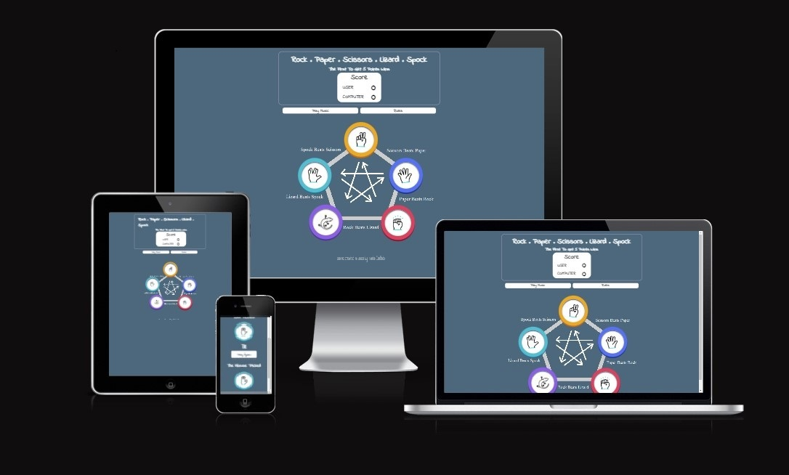
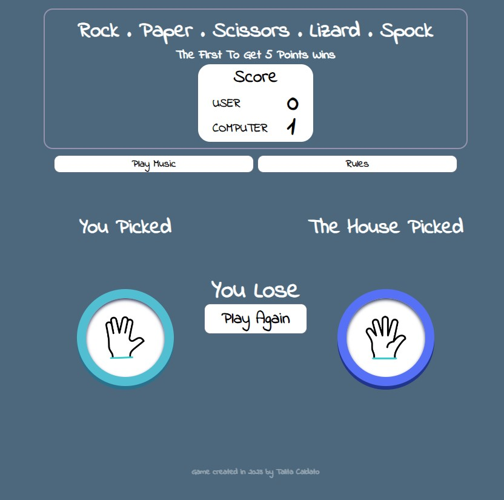
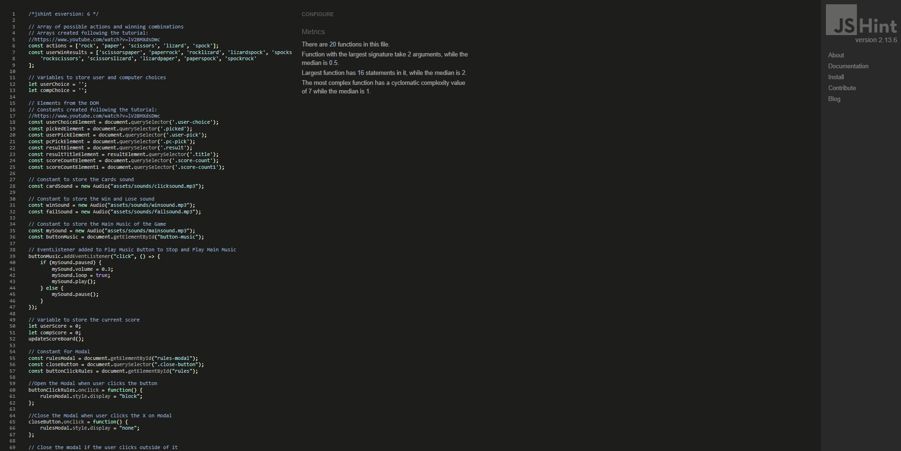

# Rock, Paper, Scissors, Lizard, Spock Game

Looking for a fun way to unwind and enjoy yourself? Why not try playing Rock, Paper, Scissors, Lizard, Spock? This game allows you to choose from five different options and play against the computer. Keep track of your score to see if you can outsmart the computer. Give it a try and see how you do! This enjoyable game was created using HTML/CSS and JavaScript.

[View the live project here](https://tcaldato.github.io/rock-paper-scissors-lizard-spock-game/)

## Table of contents

1. [UX](#ux)
    1. [The ideal user for this website](#the-ideal-user-for-this-website)
    2. [Current User Goals](#current-user-goals)
    3. [New User Goals](#new-user-goals)
    4. [Development](#development)
    5. [Target Audience](#target-audience)
        - [Roles](#roles)
        - [Demographic](#demographic)
        - [Psychographic](#psychographic)
    6. [Structure](#structure)
    7. [Design](#design)
        - [Color Scheme](#color-scheme)
        - [Typography](#typography)
2. [Features](#features)
    1. [Existing Features](#existing-features)
    2. [Features Left to Implement](#features-left-to-implement)
3. [Technologies Used](#technologies-used)
    1. [Main Languages](#main-languages)
    2. [Frameworks, Libraries and Programs](#frameworks-libraries-and-programs)
4. [Testing](#testing)
    1. [Issues and Bugs](#issues-and-bugs)
    2. [Validator Testing](#validator-testing)
    3. [Unfixed Bugs](#unfixed-bugs)
5. [Deployment](#deployment)
    1. [Deploying on GitHub Pages](#deploying-on-github-pages)
    2. [GitHub Forking and Cloning](#github-forking-and-cloning)
6. [Credits](#credits)
    1. [Code](#code)
    2. [Content](#content)
    3. [Media](#media)
7. [Acknowledgements](#acknowledgements)

## UX

### The ideal user for this website

- This website is perfect for anyone who needs a break and wants to enjoy themselves.

### Current User Goals

1. Users are looking forward to having a relaxing time.
2. Their goal is to navigate the game effortlessly and access the necessary tools with ease.
3. Their desire is to play the game with ease.

### New User Goals

1. Users want to easily understand the game rules.
2. They want to have a clear understanding of the game's score.
3. Users want visuals and color schemes that are appealing, relevant, and enjoyable to look at, and that complement the content.

### Development

The game was designed to provide entertainment for users of all ages, from children to the elderly. It was created to be easy to understand and play, allowing users to enjoy it alone or compete with others using the game's score.

### Target Audience

#### Roles

- Current users
- New users
- People who enjoy playing fast-paced games

#### Demographic

- All ages
- All Countries/Cultures

#### Psychographic

- Lifestyles:
  - All kind of life styles
- Personality/Attitudes:
  - Quiet
  - Independent
  - Creative
  - Reserved

The Game needs to enable the **user** to:

- Have an easy-to-play game that accurately scores their performance and provides an enjoyable experience.

### Structure

- The game was organized in one page:

- The Main Page is separated into three parts:

    1. The Header, with the Title of the Game and the Game Score;
    2. The Main Content, with Play Music and Rules Button, and five choices for the user;
    3. The Footer, with the name of the creator and the date the web page was created.

- When a user selects an option on the main page to play against the computer, it opens, with JavaScript, a overlapping information where they can see if they have won or lost the game:

- When the computer reaches 5 points, the game will end and display the message **Computer Wins the Game!** The score will be shown in **red** color to indicate the result.

- When the User reaches 5 points, the game will end and display the message **You Win the Game!** The score will be shown in **green** color to indicate the result.

[Back to top](#rock-paper-scissors-lizard-spock-game)

## Design

### Color Scheme

- The color scheme was chosen with the idea of fun in mind. The colors of the card game are bright and vivid, conveying a message of energy, enthusiasm, and fun. However, the background color is a shade of blue that covers most of the screen, providing a sense of calm and softness. This prevents the user from feeling tired even after playing for extended periods of time.

### Typography

- The typography pairing used on the site is [Indie Flower](https://fonts.google.com/specimen/Indie+Flower), imported from [Google Fonts](https://fonts.google.com/).

## Features

It is imperative that the website maintains a consistent and responsive navigation system throughout every page. For your convenience, detailed information regarding the available features of the site can be found below.

### Existing Features

- **The Header of the Game Page**

  - On the top of the game page, there is a title that displays the name of the game and a scoreboard that keeps track of the score as cards are selected.

- **Play Music and Rules Button**

  - Below the header, the Play Music and Rules buttons are displayed.
  - Users can control the main music by clicking the "Play Music" button. The game also includes sounds when users click on the cards and when they win or lose the game.
  - Users can access the rules of the game with the Rules Button.

 - A modal will be displayed when cickling on "Rules Button" containing a picture and a paragraph where users can find a detailed explanation about the game rules.

- **The Primary Content**

  - The primary content consists of five cards containing GIFs that display the user's available choices. The options include Rock, Paper, Scissors, Lizard, and Spock. When the user selects one of these options, new information is displayed using JavaScript. This information shows whether the user won or lost the game against the computer.
  - Behind the cards game, an image was displayed that helps the user understand how the game works and how it is scored.

- **The Footer**

  - In the footer section, the users can find the name of the creator and the date the web page was created.

### Features Left to Implement

- **Play the Game with an online friend:**
  - Feature - Provide the user with the choice to play with an online friend rather than solely with the computer.
  - Reason for not featuring in this release - I did not have enough time to create this option before the submission date and my knowledge of using other programming languages is limited.

[Back to top](#rock-paper-scissors-lizard-spock-game)

## Technologies Used

### Main Languages

- [HTML5](https://en.wikipedia.org/wiki/HTML5 "Link to HTML Wikipedia")
- [CSS3](https://en.wikipedia.org/wiki/Cascading_Style_Sheets "Link to CSS Wikipedia")
- [JavaScript](https://en.wikipedia.org/wiki/JavaScript "Link to JavaScript Wikipedia")

### Frameworks, Libraries and Programs

- [Google Fonts](https://fonts.google.com/ "Link to Google Fonts")
    - Google Fonts was used to import the font "Indie Flower" into the style.css file. This font was used throughout the project.
- [GitHub](https://github.com/ "Link to GitHub")
     - GitHub was used to store the project after pushing
- [Am I Responsive?](http://ami.responsivedesign.is/# "Link to Am I Responsive Homepage")
     - Am I Responsive was used in order to see responsive design throughout the process and to generate mockup imagery to be used.
- [Canva](https://www.canva.com/create/gif-maker/ "Link to Canva Homepage").
     - Canva was used to create GIFs.
- [Pixabay](https://pixabay.com/ "Link to Pixabay Homepage")
     - Pixabay was used to download the Game Music and Sounds.

[Back to top](#rock-paper-scissors-lizard-spock-game)

## Testing

Testing information can be found in a separate testing [File](TESTING.md "Link to testing file")

### Issues and Bugs

  The developer ran into several issues during the development of the website, with the noteworthy ones listed below along with solutions.

- A bug was identified after the user selected an image. The display of the user and PC images was not appearing on the result section, which is generated by JavaScript. I thoroughly examined the JavaScript code for errors, and I found with the help of ChatGPT, that the string interpolation el.classList.add(`game-card`, ${className}) was wrong. I removed ${} and the game-card appeared but not the GIF inside it. Another issue was found in the HTML by myself. The image name and class name were not matching, causing the function **buildChoiceElement** to fail in displaying the game-card with the GIF. After matching the names, the bug was resolved.
- I encountered a problem with the score board on my webpage. Despite refreshing the page, the score board was not resetting to zero. Initially, I had used a function that retrieved data from the local storage and added it to an **eventListener** when the page loaded. However, upon debugging the JavaScript in the browser, I discovered that the problem was caused by this function. To solve the issue, I removed the function entirely, which resolved the problem. Now, whenever a user refreshes the page, the score resets to zero.
- A bug was indentified trying to replace the **Play Again** button to **Reset Game** and the page be refreshed. When I tried to refresh the page clicking on the button, it only refresehed when clicking twice.The function **resetGame** had a mistake, I created the variable **btn** and after that the eventListener was added. I removed this variable and I left only the eventListener. This action fixed the bug and the page can be refresh normally.

### Validator Testing

- HTML
  - No errors were returned when passing the Game Page through the official [W3C validator](https://validator.w3.org/nu/?doc=https%3A%2F%2Ftcaldato.github.io%2Frock-paper-scissors-lizard-spock-game%2F)
  
- CSS
  - No errors were found when passing through the official [(Jigsaw) validator](https://jigsaw.w3.org/css-validator/validator?uri=https%3A%2F%2Ftcaldato.github.io%2Frock-paper-scissors-lizard-spock-game%2F&profile=css3svg&usermedium=all&warning=1&vextwarning=&lang=en)

- JavaScript
  - No errors were found when passing through the official JSHint validator:

    

    
JSHint validator results

    

    

### Unfixed Bugs

- All of the bugs that were discovered have been resolved.

[Back to top](#rock-paper-scissors-lizard-spock-game)

## Deployment

### Deploying on GitHub Pages

- To deploy this page to GitHub Pages from its GitHub repository, the following steps were taken:

 1. Log into GitHub or create an account.
 2. Locate the GitHub Repository.
 3. At the top of the repository, select Settings from the menu items.
 4. Scroll down the Settings page to the "Pages" section.
 5. Under "Source" click the drop-down menu labeled "None" and select "Main".
 6. Upon selection, the page will automatically refresh meaning that the website is now deployed.
 7. Scroll back down to the "Pages" section to retrieve the deployed link.

### GitHub Forking and Cloning

To fork and clone the project, you can get more information on  you will need to follow these steps:

1. Forking a GitHub repository.

    You might fork a project to propose changes to the upstream, or original, repository. In this case, it's good practice to regularly sync your fork with the upstream repository. To do this, you'll need to use Git on the command line.
    - Navigate to the repository you wish to fork.
    - In the top-right corner of the page, click Fork.
    - Under "Owner," select the dropdown menu and click an owner for the forked repository.
    - By default, forks are named the same as their upstream repositories. Optionally, to further distinguish your fork, in the "Repository name" field, type a name.
    - Optionally, in the "Description" field, type a description of your fork.
    - Click Create fork.

2. Cloning your forked repository.

    - Navigate to your forked repository.
    - Above the list of files, click 'Code'.
    - To clone the repository using HTTPS:
        - Under "Clone with HTTPS", click the copy icon (a clipboard).
    - To clone the repository using an SSH key, including a certificate issued by your organization's SSH certificate authority:
        - Click 'Use SSH', then click the copy icon.
    - To clone a repository using GitHub CLI:
        - Click 'Use GitHub CLI', then click the copy icon.
    - Open Git Bash.
    - Change the current working directory to the location where you want the cloned directory.
    - Type git clone, and then paste the URL you copied earlier. It will look like this:
        git clone https://hostname/YOUR-USERNAME/repo-name
    - Press Enter. Your local clone will be created.

[Back to top](#rock-paper-scissors-lizard-spock-game)

## Credits

### Content

- The Read Me was written based on Code Institute [Read Me Template](https://github.com/Code-Institute-Solutions/readme-template) and My previous Project [Thrash Metal History](https://github.com/TCaldato/portfolio1-metal).
- My Brother [Rodrigo Caldato](https://www.linkedin.com/in/rodrigo-caldato-391137115/) helped me understand the logic of JavaScript.

### Media

- The Background Image was created by me using Paint app.
- Some GIFs are from [Font Awesome](https://fontawesome.com/).
- The Rules image was taken from [Twitter](https://twitter.com/Lagana/status/175639722759163904).

### Code

- To ensure proper implementation of the code, I conducted thorough research and consulted multiple websites. When using copied and edited code, I made sure to reference it properly. The following websites were frequently used during my research process:

    - The game was created based on the code from [Competent Programming](https://www.youtube.com/watch?v=lV2BMXdsDmc) on YouTube.
    - [W3Schools](https://www.w3schools.com/#gsc.tab=0)
    - [Stack Overflow](https://stackoverflow.com/)
    - [Blog HubSpot](https://blog.hubspot.com/)
    - [ChatGPT](https://chat.openai.com/)

[Back to top](#rock-paper-scissors-lizard-spock-game)

## Acknowledgements

- I am grateful to Seun, my tutor, for her unwavering support throughout my project. Her expert guidance and motivation helped me excel and achieve my goals.
- I would like to thank my brother Rodrigo for his patience in helping and teaching me during my dark hours.

[Back to top](#rock-paper-scissors-lizard-spock-game)