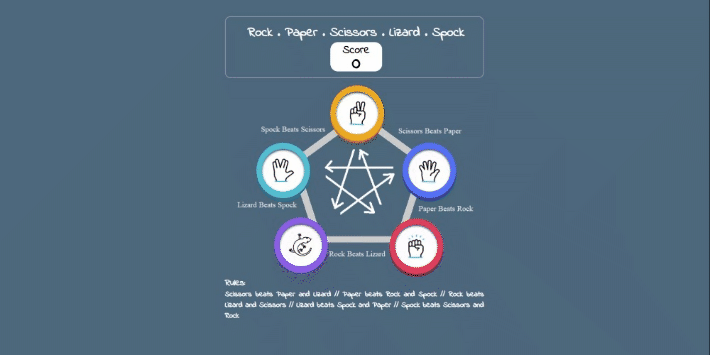
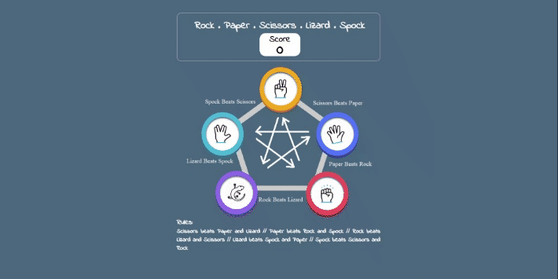
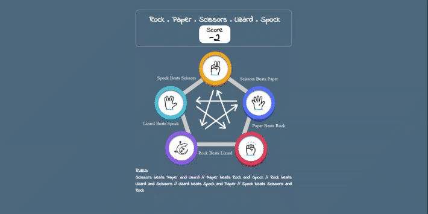
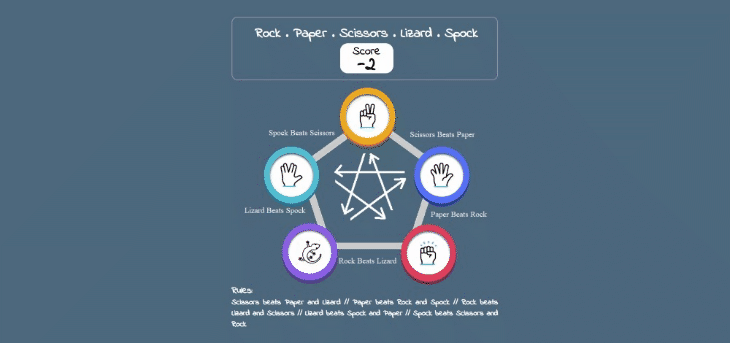
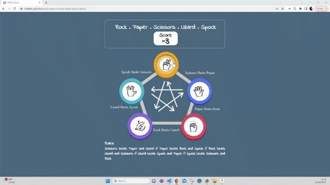

# Rock, Paper, Scissors, Lizard, Spock Game - Testing

This section will thoroughly assess all project features to ensure proper functionality as intended. The project's purpose is to enable users to achieve their goals through a straightforward and efficient approach.

## Manual Testing

### Game Page

Manual testing was conducted on the following elements that appear on the Game Page:

- All Gifs on the Game Page are functioning correctly.

 

- When the User selects a Game-Card, the result page will be opened. Points will be added or removed in the scoreboard depending on whether the User wins or loses, and do not change when it is a tie.

- The First Card is the Scissors Game-Card:

- The Second Card is the Paper Game-Card:

- The Third Card is the Rock Game-Card:

- The Fourth Card is the Lizard Game-Card:

- The Fifth Card is the Spock Game-Card:

- To reset the scoreboard to zero, the user can simply refresh the page:

### Browser Validation

- The testing on various browsers was also conducted, and the following browsers were tested:

- Chrome:

- Edge:

    
- Mozilla:

- Opera:

[Back to top](#rock-paper-scissors-lizard-spock-game---testing)