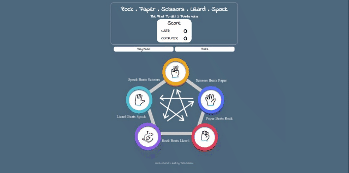
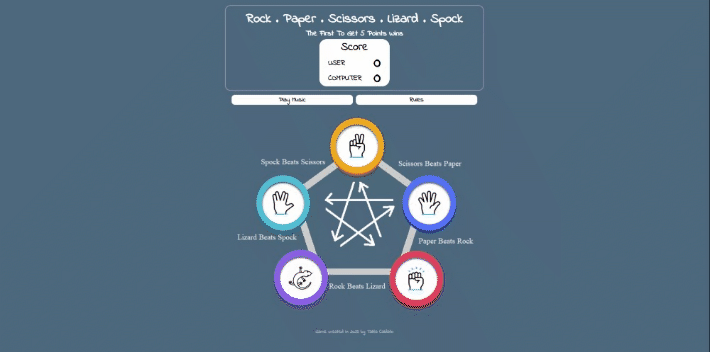
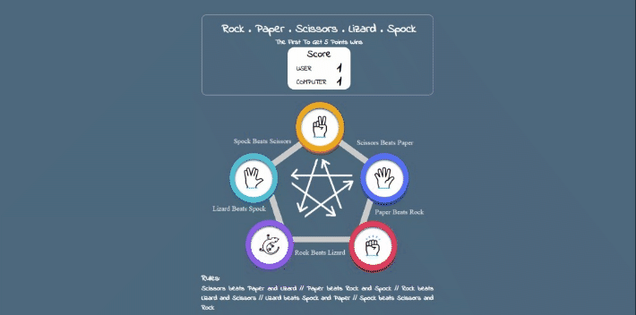
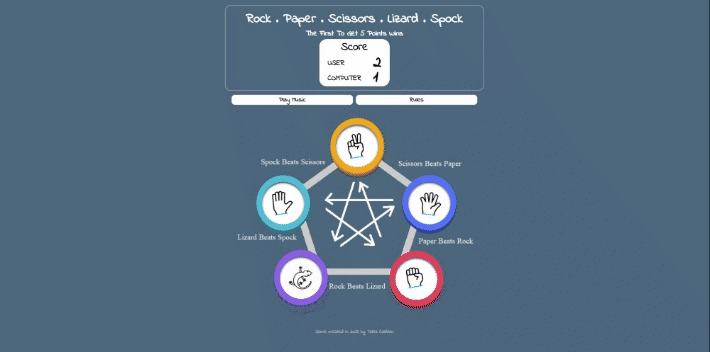

# Rock, Paper, Scissors, Lizard, Spock Game - Testing

This section will thoroughly assess all project features to ensure proper functionality as intended. The project's purpose is to enable users to achieve their goals through a straightforward and efficient approach.

To go back to ReadMe file click [HERE](README.md "Link to readme file")

## Table of contents

1. [Manual Testing](#manual-testing)
    1. [Game Page](#game-page)
        - [Card Gifs](#card-gifs)
        - [Play Music and Rules Button](#play-music-and-rules-button)
        - [Game-Card Selection](#game-card-selection)
        - [Scoreboard](#scoreboard)
        - [Reset Game Button](#reset-game-button)
2. [JavaScript Validation](#javascript-validation)
3. [Browser Validation](#browser-validation)
4. [User Testing](#user-testing)

## Manual Testing

### Game Page

A comprehensive evaluation was carried out to verify the functionality of every single element on the Game Page, and there were no issues found. All features tested performed as intended, indicating that the system is functioning optimally.

#### Card Gifs

- All Gifs on the Game Page are functioning correctly.

 

#### Play Music and Rules Button

- When the user clicks "Play Music", music begins playing. Clicking the "Rules" button displays a modal with an image and text explaining the game rules. Everything is functioning correctly.

#### Game-Card Selection

- When the User selects a Game-Card, the result page will be opened. Points will be added or removed in the scoreboard depending on whether User wins or loses, and do not change when it is a tie.

- The First Card is the Scissors Game-Card:

- The Second Card is the Paper Game-Card:

- The Third Card is the Rock Game-Card:

- The Fourth Card is the Lizard Game-Card:

- The Fifth Card is the Spock Game-Card:

#### Scoreboard

- The scoreboard will add points for both the computer and user, but will not change the score if it is a tie. The game will end when either the computer or user reaches 5 points, and the color of the scoreboard will change accordingly. If the user wins, the score will turn green, and if the computer wins, the score will turn red. No issues were found:

#### Reset Game Button

- When User or Computer reaches the score 5, the button **Play Again** will be replaced for **Reset Game** button, and the game starts again when the User clicks on it.

[Back to top](#rock-paper-scissors-lizard-spock-game---testing)

## JavaScript Validation

- JavaScript code was validated by JS Hint:

[Back to top](#rock-paper-scissors-lizard-spock-game---testing)

## Browser Validation

The testing on various browsers was also conducted, and no issues were found. The following browsers were tested:

- Chrome:

- Edge:

- Mozilla:

- Opera:

[Back to top](#rock-paper-scissors-lizard-spock-game---testing)

## User Testing

My husband, my Brother and my Mentor Seun were asked to review the game to point out any bugs and/or user experience issues. Their helpful advice throughout the process led to a few small UX changes in order to create a better experience.

[Back to top](#rock-paper-scissors-lizard-spock-game---testing)

To go back to ReadMe file click [HERE](README.md "Link to readme file")